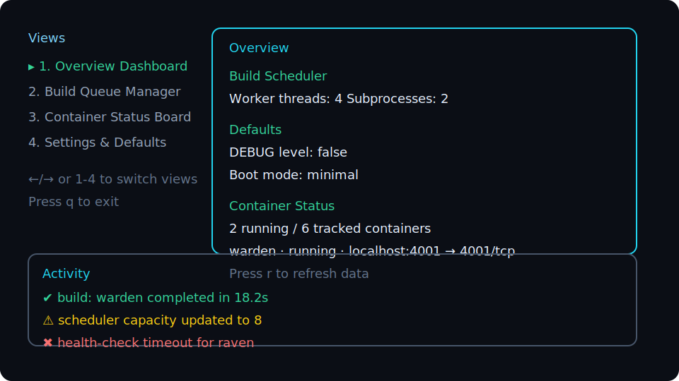

# Deployment Interface (TUI)

The deployment utilities now ship with an interactive terminal UI built on [Ink](https://github.com/vadimdemedes/ink). The experience replaces the legacy readline prompts with navigable views, live Docker feedback, and keyboard-accessible controls.

Run the interface with either command:

```bash
npm install # only required once to pull Ink + React runtime
node deployment/cli.mjs
```



## Views &amp; Controls

### Overview Dashboard
* Summarises build concurrency defaults, debug/boot defaults, container counts, and the five most recent lifecycle events.
* Keyboard: `r` refreshes the data snapshot.

### Build Queue Manager
* Multi-select (`space`) one or more services (`a` selects all, `n` clears selection).
* Choose operation via shortcuts: `b` build, `p` push, `l` pull.
* Toggle clean builds with `c` (applies `--no-cache`).
* Execute queued work with `g`. Per-service progress appears inline while structured logs stream into the activity panel.

### Container Status Board
* Lists discovered `noona-*` containers with state and exposed ports.
* Keyboard shortcuts: `r` refresh, `k` stop all containers, `w` boot the Warden orchestrator, `x` clean selected services, `d` delete all managed Docker resources (with confirmation prompt).

### Settings &amp; Defaults
* Adjust worker thread/subprocess capacity or update default `DEBUG`/boot-mode values.
* Navigation is fully keyboard driven (`↑/↓` select menu item, `enter` apply, `esc` cancel).
* Updates persist to `deployment/build.config.json` so future sessions inherit new defaults.
* Access the deployment log directory (and launch Windows Explorer when available) via the settings menu.

## Live Feedback &amp; Accessibility

* All Docker operations stream success/failure toasts into the activity log while builds emit incremental status lines.
* Spinner indicators and high-contrast colour palettes keep long-running jobs visible.
* Every interaction is keyboard accessible: view switching (`←/→`, `1-4`), operation shortcuts, and `q`/`Ctrl+C` to exit.
* The terminal layout is screen-reader friendly—landmarks use semantic ordering and announcements surface through the shared activity log.

## Deployment logs

Each CLI session writes structured output to timestamped files under `deployment/logs/`. The tool automatically keeps the three most recent files and prunes older entries on startup. Non-reporter activity feed messages are now persisted alongside build/push/pull output, so the Activity panel mirrors the log history. Use the new "Open deployment log folder" option in **Settings &amp; Defaults** to jump into the directory (launches `explorer.exe` on Windows, reports the location on other platforms).

## Batch Operations

The TUI supports batching across services:

* Build/push/pull multiple images concurrently via the Build Queue Manager.
* Clean targeted services or delete all stack resources from the Container Status Board.
* Scheduler telemetry (capacity changes, per-service completion) is relayed through the shared reporters in `deployment/dockerManager.mjs`, so additional automation can subscribe to the same hooks if needed.

Refer to the on-screen hints within each view for up-to-date shortcuts and status indicators.

## Windows Docker hosts

The deployment CLI now shares Warden's Windows detection logic. `DOCKER_HOST` or CLI config entries using `npipe://` endpoints are normalized to the `//./pipe/...` path before creating the Dockerode client. When running on Windows, the tool also queries available Docker pipes via:

```powershell
Get-ChildItem -Path '\\.\pipe\' -Filter '*docker*' | Select -ExpandProperty FullName
```

This allows the same build and install workflows to operate against Docker Desktop named pipes without requiring manual socket adjustments.
